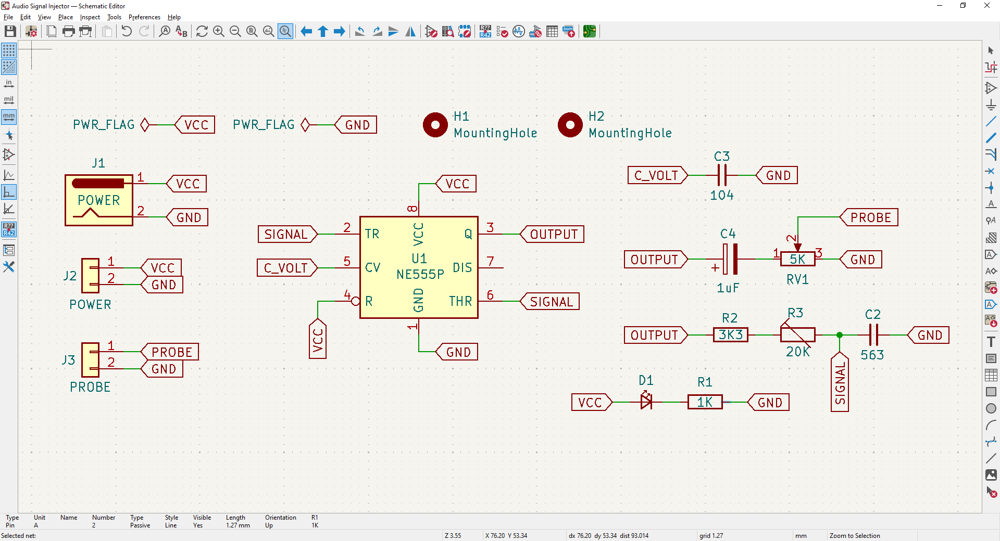
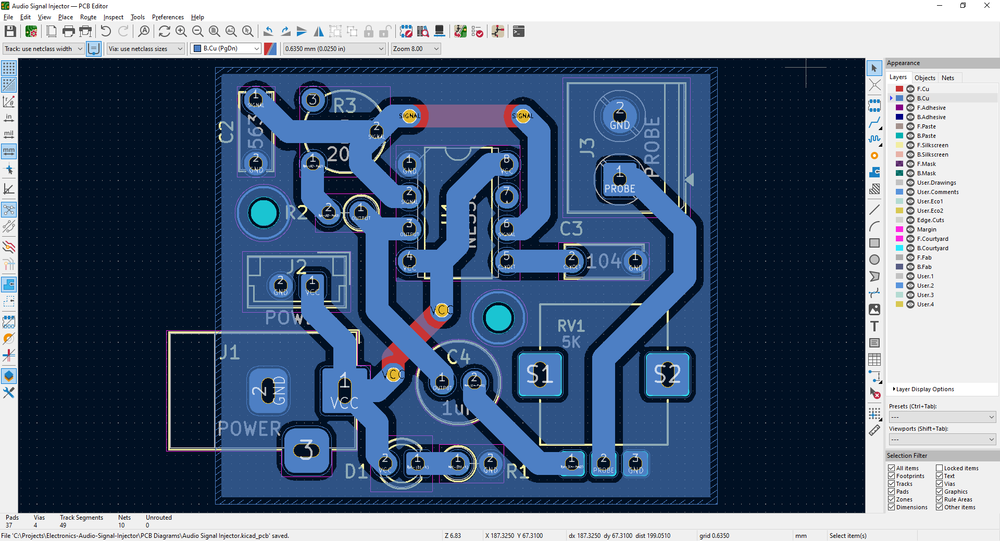
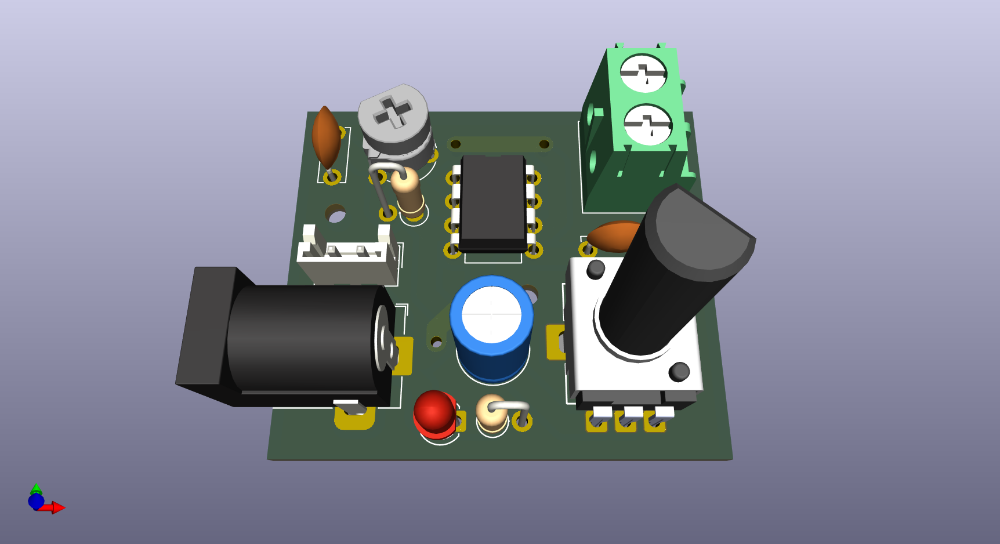
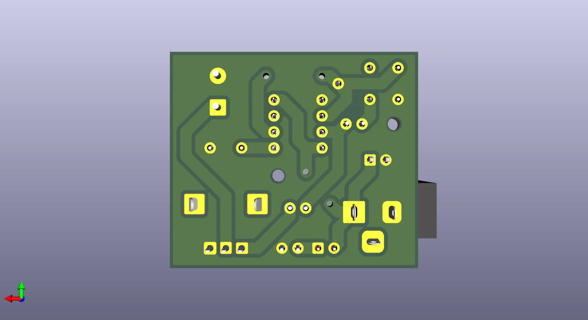

# Audio Signal Injector

A simple signal injector for faults diagnosing in audio equipment.  
Schematics diagram + PCB diagram (KiCAD 9) and case 3D model (Blender) are also provided.  

Based on the Espacio de Cesar's video:
[Audio Signal Injector](https://www.youtube.com/watch?v=kp08ScxISPk) [spanish].

&nbsp;

### Notes:

- Turn the potentiometer to adjust the volume.
- Turn de trimmer to adjust the injected audio frecuency.
- Use the probes on speakers, buzzers and so on to diagnose audio problems.
- Power input: 5-12 VDC

&nbsp;

### List of Materials

- 1 x IC NE555
- 1 x Capacitor 56nF
- 1 x Capacitor 100nF
- 1 x Electrolitic capacitor 1uF
- 1 x Resistor 3.3k ohms
- 1 x Trimmer 20k ohms
- 1 x Potentiometer 5k ohms
- 1 x LED
- 1 x Resistor 470 ohms
- 1 x Rocker Button (power on/off)
- 2 x Banana connector
- 1 x Bornier connector 2-pins / JST connector 2-pins
- 1 x 9V battery / 2 x 18650 battery
- 1 x 9V battery holder / 1 x 18650 battery holder x2
- Wires

&nbsp;

### Screenshots

| Breadboard                                           | Assembly                                             |
|------------------------------------------------------|------------------------------------------------------|
|                    |                    |

| Schematics Diagram                                   | PCB Diagram                                          |
|------------------------------------------------------|------------------------------------------------------|
|              |                     |

| PCB Render 3D                                        | PCB Render 3D                                        |
|------------------------------------------------------|------------------------------------------------------|
|             |            |

| Case 3D Model                                        | Project Final                                        |
|------------------------------------------------------|------------------------------------------------------|
|                    |                    |

See 'Rescources' sub-folder for more pictures & videos of the project.

&nbsp;

### Version History

v1.0 (2026.01.06) - Initial release.  

&nbsp;

This source code is licensed under GPL v3.0  
Please send me your feedback about this project: andres.garcia.alves@gmail.com
